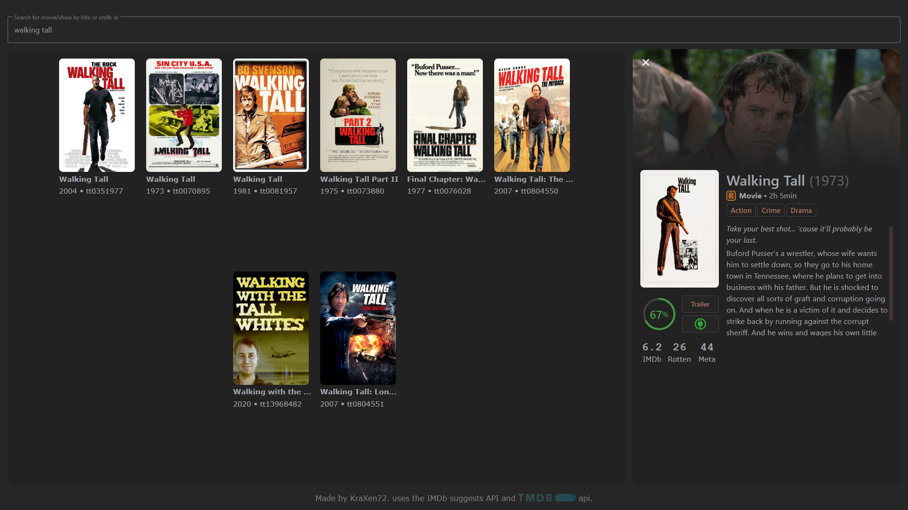

# imdb-fetch
> small, fast & useful movie app.    
  
- website: [https://kraxen72.github.io/imdb-fetch/](https://kraxen72.github.io/imdb-fetch/)
- quickly provides a movies/shows IMDb/TMDB id, and information about it.  
- i made this primarily because imdb.com was too slow and i just needed the ids.
- feel free to check out [API's used/credits](#apis-usedcredits) and [notes](#notes)
  

  
also has mobile ui: (outdated screenshot but i cannot be bothered to re-make it in gimp)

  
### API's used/credits:
- [IMDb suggets api](https://stackoverflow.com/questions/1966503/does-imdb-provide-an-api) crude but free jsonp imdb api. only gives like 10 results or so but works.
- [themoviedb.org](https://www.themoviedb.org) TMDB api - used to fetch most info about the movie/show
- [OMDb api](http://www.omdbapi.com) request-limited api used to get IMDB, rotten and metacritic scores.
- thanks to [this pen on codepen](https://codepen.io/magdielikari/pen/KKmmjWo) for circular progress

### support development

  
Any donations are highly appreciated! <3
  
### notes
- i wrote this fully client side webapp in summer 2021, used it on and off for the following year
- in september 2022 i decided to give it a pretty major rewrite, including a few of these things:
  - almost full backend & api handling rewrite
  - more information about shows like: status, episode length last & next episode to air
  - a smart age rating system, that takes into account ages from multiple countries, picks the most likely one & shows others on hover. (this took really long but it's really cool) + also cool colors for different age groups
  - better support for random imdb entries like "tv movie" and "video"
  - full poster fetching rewrite, includding [reverse-engineering a CDN api](https://stackoverflow.com/questions/73089650/what-are-the-parameters-for-aws-media-amazon-image-hosting/73501833#73501833) 
  - epic and pog circular progress for tmdb rating
  - three or four styling & css rewrites. 